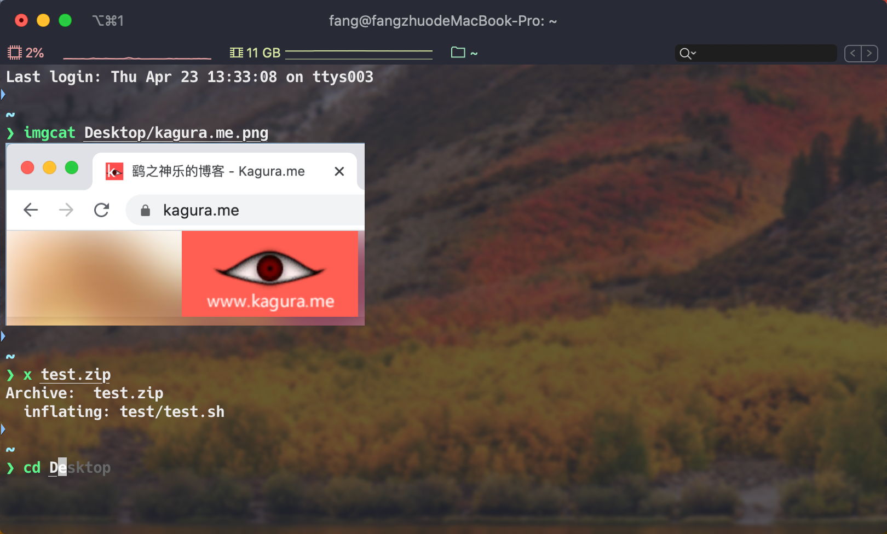

# 快速安装一个漂亮强大的iTerm2

**你的mac重装系统后应该执行的第一条命令**

### 快速安装
国内:` sh -c "$(curl -fsSL https://code.aliyun.com/kar/ohmyiterm2/raw/master/install.sh)" "" aliyun`

国外:` sh -c "$(curl -fsSL https://raw.githubusercontent.com/KingFalse/ohmyiterm2/master/install.sh)" "" github`

### 屏幕预览

### 它安装了什么
* 安装Xcode Command Line Tools
* 安装[ohmyzsh](https://github.com/ohmyzsh/ohmyzsh)
* 安装[ohmyzsh插件git-open](https://github.com/paulirish/git-open)
* 安装[ohmyzsh插件zsh-autosuggestions](https://github.com/zsh-users/zsh-autosuggestions)
* 安装[ohmyzsh插件zsh-syntax-highlighting](https://github.com/zsh-users/zsh-syntax-highlighting)
* 安装[ohmyzsh插件autojump](https://github.com/wting/autojump)
* 安装[ohmyzsh主题starship](https://starship.rs/)
* 安装[iTerm2](https://iterm2.com/)
* 安装[iTerm2-Utilities扩展](https://www.iterm2.com/documentation-utilities.html)
* 安装[iTerm2-Dracula主题](https://github.com/dracula/iterm)
* 安装[lrzsz并配置Triggers](https://ohse.de/uwe/software/lrzsz.html)
* 安装sshpass

### 感谢
* 感谢JetBrains提供IDEA LICENSE支持：[https://www.jetbrains.com/?from=ohmyiterm2](https://www.jetbrains.com/?from=ohmyiterm2)

